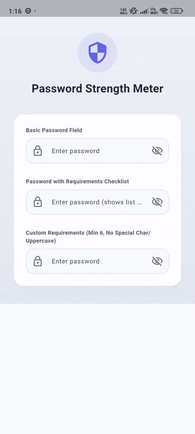

# flutter_password_strength_meter

[](https://flutter.dev)
[](https://opensource.org/licenses/MIT)
[](#)

**flutter_password_strength_meter** is a premium, highly customizable, and interactive real-time password strength validation widget for Flutter. It features visual strength bars, an interactive real-time checklist, custom security rules, aesthetic custom styling, and seamless integration without forcing form submit buttons.

---

## 📷 Preview

<p align="center">
  
</p>

*A premium interactive password strength field featuring automatic segment animations, live requirements checking, custom border indicators, and standalone/form validation support.*

---

## ✨ Features

- **📊 Real-time Strength Estimator**
  - Dynamically evaluates password strength across 5 visual levels: Very Weak, Weak, So-so, Good, and Strong.
  - Features smooth animated segments matching the strength level color.
- **📝 Live Checklist Overlays**
  - Optional requirements checklist (length, uppercase, lowercase, numbers, special characters) that updates instantly as the user types.
- **⚙️ Configurable Password Rules**
  - Easily customize parameters such as minimum password length, and require specific characters (numbers, special chars, casing).
- **🎨 High-Fidelity Custom Styling**
  - Adjust border corner radius, background fill colors, and border widths.
  - Focus border colors can dynamically match the current password strength level's color.
- **🚀 Standalone & Form Modes**
  - By default, works completely standalone (updates dynamically without displaying validation errors or requiring a form/submit button).
  - Can easily be integrated into standard Flutter `Form` validation by setting `enableDefaultValidation: true`.
- **🔒 Integrated Visibility Toggle**
  - Built-in suffix toggle button to easily obscure or show password text.

---

## 📦 Installation

To use this library in your Flutter project, add it to your `pubspec.yaml` dependencies:

```yaml
dependencies:
  flutter:
    sdk: flutter
  # From pub.dev
  flutter_password_strength_meter_library: ^0.0.1
```

Or reference it directly from a Git repository:

```yaml
dependencies:
  flutter_password_strength_meter_library:
    git:
      url: https://github.com/your_username/flutter_password_strength_meter.git
      ref: main
```

---

## 🚀 Usage

Import the package in your Dart code:

```dart
import 'package:flutter_password_strength_meter_library/password_strength_field.dart';
```

### 1. Simple Standalone Field (No Validation / No Button Required)
By default, the field updates the strength bar dynamically as the user types without requiring any forms or validation buttons.

```dart
PasswordStrengthField(
  controller: _passwordController,
  labelText: 'New Password',
  hintText: 'Enter password',
  borderRadius: 16.0,
  fillColor: const Color(0xFFF8FAFC),
)
```

### 2. Standalone Field with Live Checklist
You can show a live list of criteria checklist that updates in real-time below the strength meter.

```dart
PasswordStrengthField(
  controller: _passwordController,
  labelText: 'Secure Password',
  hintText: 'Enter password',
  showChecklist: true,
  borderRadius: 16.0,
)
```

### 3. Custom Strength Rules
Set specific length and characters rules to adjust what qualifies as a strong password.

```dart
PasswordStrengthField(
  controller: _passwordController,
  labelText: 'Simple Code',
  hintText: 'Enter numeric passcode',
  minPasswordLength: 6,
  requireUppercase: false,
  requireSpecialChar: false,
  showChecklist: true,
)
```

### 4. Enable Standard Form Validation
If you want to enforce validation inside a Flutter `Form`, set `enableDefaultValidation: true`. This prevents submission if rules aren't met.

```dart
Form(
  key: _formKey,
  child: Column(
    children: [
      PasswordStrengthField(
        controller: _passwordController,
        labelText: 'Account Password',
        enableDefaultValidation: true,
        showChecklist: true,
      ),
      ElevatedButton(
        onPressed: () {
          if (_formKey.currentState!.validate()) {
            // Form is valid!
          }
        },
        child: const Text('Submit'),
      ),
    ],
  ),
)
```

---

## 🛠️ API Reference

### `PasswordStrengthField` properties:

| Property | Type | Default | Description |
| :--- | :--- | :--- | :--- |
| `controller` | `TextEditingController?` | `null` | Controller for the text input field. |
| `labelText` | `String?` | `null` | Label text displayed above the field. |
| `hintText` | `String?` | `null` | Hint placeholder text displayed inside the field. |
| `validator` | `String? Function(String?)?` | `null` | Custom validator function. If provided, overrides default validation. |
| `obscureText` | `bool` | `true` | Whether to obscure the text initially. |
| `showPasswordToggle` | `bool` | `true` | Whether to show the visibility toggle icon. |
| `showStrengthMeter` | `bool` | `true` | Whether to show the animated strength bar indicator. |
| `showChecklist` | `bool` | `false` | Whether to show the requirement checklist. |
| `minPasswordLength` | `int` | `8` | Minimum password length requirement. |
| `requireUppercase` | `bool` | `true` | Require at least one uppercase letter. |
| `requireLowercase` | `bool` | `true` | Require at least one lowercase letter. |
| `requireNumber` | `bool` | `true` | Require at least one numeric digit. |
| `requireSpecialChar` | `bool` | `true` | Require at least one special character (`!@#$&*~._-`). |
| `enableDefaultValidation` | `bool` | `false` | Enable automatic form validation. |
| `borderRadius` | `double` | `12.0` | Outer border corner radius. |
| `borderWidth` | `double` | `1.5` | Border lines width. |
| `fillColor` | `Color?` | `null` | Background color of the input field. |
| `focusedBorderColor` | `Color?` | `null` | Border color when focused. If null, dynamically matches the current password strength level's color. |

---

## 📄 License

```lic
MIT License

Copyright (c) 2026 Excelsior Technologies

Permission is hereby granted, free of charge, to any person obtaining a copy
of this software and associated documentation files (the "Software"), to deal
in the Software without restriction, including without limitation the rights
to use, copy, modify, merge, publish, distribute, sublicense, and/or sell
copies of the Software, and to permit persons to whom the Software is
furnished to do so, subject to the following conditions:

The above copyright notice and this permission notice shall be included in all
copies or substantial portions of the Software.

THE SOFTWARE IS PROVIDED "AS IS", WITHOUT WARRANTY OF ANY KIND, EXPRESS OR
IMPLIED, INCLUDING BUT NOT LIMITED TO THE WARRANTIES OF MERCHANTABILITY,
FITNESS FOR A PARTICULAR PURPOSE AND NONINFRINGEMENT. IN NO EVENT SHALL THE
AUTHORS OR COPYRIGHT HOLDERS BE LIABLE FOR ANY CLAIM, DAMAGES OR OTHER
LIABILITY, WHETHER IN AN ACTION OF CONTRACT, TORT OR OTHERWISE, ARISING FROM,
OUT OF OR IN CONNECTION WITH THE SOFTWARE OR THE USE OR OTHER DEALINGS IN THE
SOFTWARE.
```
